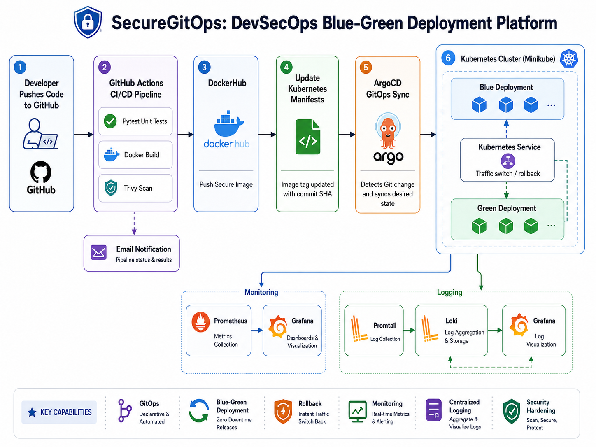

# SecureGitOps: DevSecOps Blue-Green Deployment Platform

SecureGitOps is a DevSecOps and GitOps project that automates secure Kubernetes deployments using GitHub Actions, Docker, Trivy, ArgoCD, Prometheus, Grafana, Loki, and Promtail.

## What this project does

- Runs a Python Flask application
- Builds and scans Docker images
- Pushes images to DockerHub
- Updates Kubernetes manifests automatically
- Deploys using ArgoCD GitOps
- Supports blue-green deployment and rollback
- Monitors the cluster using Prometheus and Grafana
- Collects logs using Loki and Promtail
- Sends email notification after pipeline success or failure

## Architecture Flow

## Tech Stack

Python Flask, Docker, GitHub Actions, Trivy, DockerHub, Kubernetes, Minikube, ArgoCD, Prometheus, Grafana, Loki, Promtail.

## Documentation

Detailed implementation notes are available in:

docs/implementation-notes.md

## Project Status

Completed:

- CI/CD pipeline
- GitOps CD with ArgoCD
- Blue-green deployment
- Rollback testing
- Trivy security scanning
- Kubernetes security hardening
- Prometheus and Grafana monitoring
- Loki and Promtail logging
- Email notification

Kyverno was tested but removed because it overloaded the local Minikube environment. It is kept as a future enhancement.
